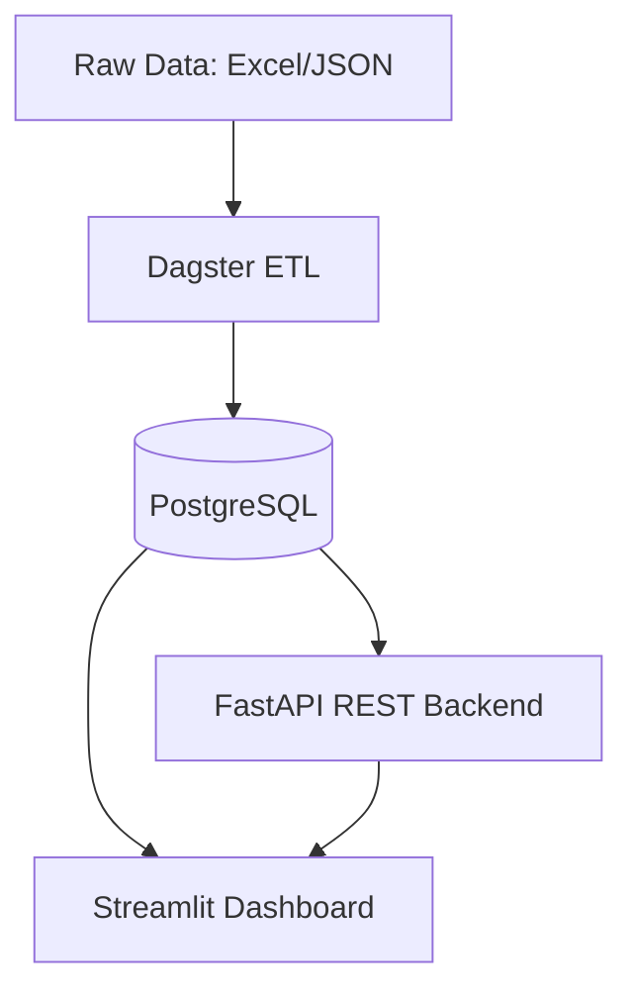

# CaRMS Program Explorer (Data Warehouse + Analytics)

A production-style data platform for processing and analyzing CaRMS residency program data. This project automates the extraction of program details from raw Excel and JSON sources into a structured PostgreSQL warehouse.

## Architecture



## Tech Stack

- **ETL Orchestration**: [Dagster](https://dagster.io/) (Asset-based data pipelines)
- **API Framework**: [FastAPI](https://fastapi.tiangolo.com/) + [SQLModel](https://sqlmodel.tiangolo.com/)
- **Frontend/BI**: [Streamlit](https://streamlit.io/) + [Plotly](https://plotly.com/)
- **Database**: PostgreSQL 16
- **Containerization**: Docker Compose

## Quickstart

### 1. Prerequisites
- Docker and Docker Compose
- Python 3.12 (optional, for local script execution)

### 2. Data Preparation (IMPORTANT)
The raw data is stored in the `data/raw/` directory. Due to size limitations in some environments, larger files (like program descriptions) may be provided as ZIP files.

**Mandatory Action:**
Before running the ETL, you must ensure the following files exist in `data/raw/`. If you see `.zip` files, **extract them** so that the target filenames match exactly:

- `1503_discipline.xlsx`: Discipline lookup table.
- `1503_program_master.xlsx`: Core residency program data.
- `1503_markdown_program_descriptions.json`: Full program descriptions in Markdown format (extact from zip if necessary).

### 3. Run Services
From the project root, start the entire stack:
```bash
cd docker
docker-compose up --build
```

This will spin up:
- **Streamlit**: [http://localhost:8501](http://localhost:8501) (Dashboard)
- **FastAPI**: [http://localhost:8000/docs](http://localhost:8000/docs) (API Documentation)
- **Dagster**: [http://localhost:3000](http://localhost:3000) (ETL Orchestration)

### 4. Load Data (Execute ETL)
1. Open the **Dagster UI** at [http://localhost:3000](http://localhost:3000).
2. Navigate to the **Assets** tab.
3. Click **Materialize All** to trigger the pipeline.
4. Once completed, the Streamlit Dashboard will automatically reflect the updated data.

## Project Structure

```text
.
├── data/raw/           # Raw data sources (Excel, JSON, ZIPs)
├── docker/             # Docker configuration and Dockerfile
├── src/carms/
│   ├── api/            # FastAPI backend and routers
│   ├── db/             # SQLModel schemas and engine config
│   ├── dashboard/      # Streamlit analytics code
│   ├── etl/            # Dagster assets and resource definitions
│   └── config.py       # Configuration management (Pydantic)
├── dagster.yaml        # Dagster internal configuration
├── workspace.yaml      # Dagster workspace definitions
└── requirements.txt    # Python dependencies
```

## Useful Tools
- `inspect_db.py` (Local utility): Run `python inspect_db.py` on the host to quickly verify database connectivity and view schema/statistics. It automatically handles `postgres` vs `localhost` hostnames.
